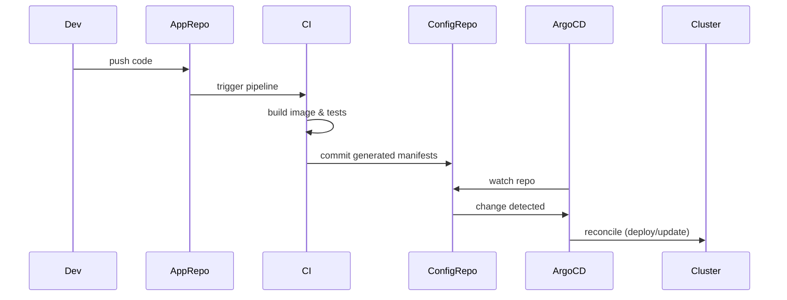

# Code repo vs Configuration (config) repo

**Concept:** separate source code (app repo) from the declarative desired-state (config repo). CI builds artifacts and updates the config repo; Argo CD watches the config repo and reconciles cluster state.

- App repo: application source, Dockerfile, CI pipeline. CI builds images and (optionally) generates manifests/values.
- Config repo: environment overlays, manifests/Helm charts — the single source of truth for cluster state.
- Argo CD: continuously watches the config repo and applies the desired state to the cluster.

> *Speaker notes:* Emphasize separation of concerns — app authors work in the app repo; environment-specific configuration lives in the config repo. Benefits: auditability, easy rollbacks, and automated promotions.

